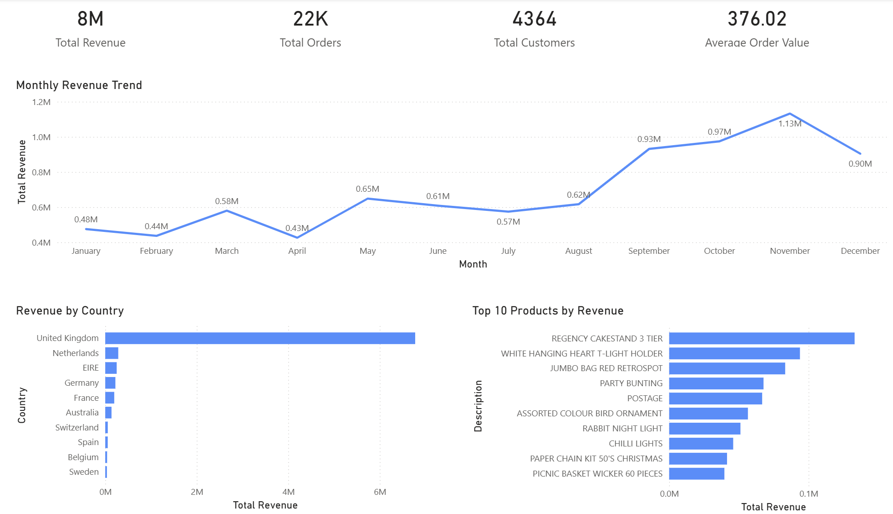
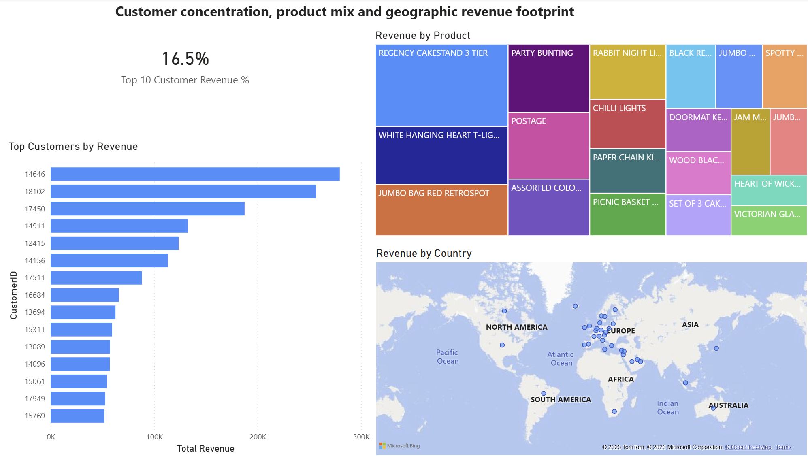

# Retail Revenue & Customer Analysis Dashboard (Power BI)

## Project Objective

The objective of this project is to demonstrate how Power BI can be used to transform transactional retail data into clear business insights for decision makers.

Power BI dashboard analysing retail revenue trends, customer concentration, product performance, and geographic sales patterns using the Online Retail dataset.

## Dashboard Pages

### 1. Executive Overview
This page provides a high-level business summary, including:

- Total Revenue
- Total Orders
- Total Customers
- Average Order Value
- Monthly Revenue Trend
- Revenue by Country
- Top 10 Products by Revenue

  

### 2. Customer & Product Insights
This page explores deeper commercial insights, including:

- Top 10 Customers Share of Revenue
- Top Customers by Revenue
- Revenue by Product
- Revenue by Country

  

## Skills Demonstrated

• Power BI dashboard development  
• Data cleaning using Power Query  
• DAX measures and calculated columns  
• Data visualisation and storytelling  
• Business insight generation  
• Customer concentration analysis  

## Key Insights

• Revenue shows strong seasonality, peaking in November.
• The United Kingdom generates the majority of total revenue.
• Customer revenue is concentrated — the top 10 customers generate 16.5% of revenue.
• Product sales are concentrated among a small group of gift-oriented items.

## Data Preparation

The following cleaning steps were completed in Power BI / Power Query:

- Removed cancelled invoices (InvoiceNo beginning with "C")
- Removed rows with blank CustomerID
- Created a Revenue column as `Quantity * UnitPrice`
- Built DAX measures for revenue, orders, customers, and average order value

## Files

- `Retail_Revenue_Customer_Analysis.pbix` — Power BI dashboard file
- `executive_overview.png` — Screenshot of Page 1
- `customer_product_insights.png` — Screenshot of Page 2
- `dataset_source.txt` — Dataset source and preparation notes

## Dataset Source

Online Retail dataset from the UCI Machine Learning Repository.

## Author

Sam H
